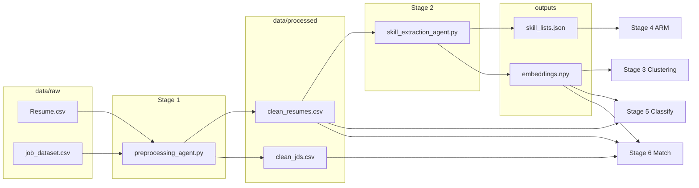

# CSE572 Resume Screening Project — Complete Presentation Guide

This document is your **end-to-end reference** for what the team built, how the pipeline works, what each file does, and how to explain the results. Read it in order the first time; use the table of contents to jump when rehearsing.

---

## Table of contents

0. [If your group is starting from zero: read this first](#0-if-your-group-is-starting-from-zero-read-this-first)
1. [What problem does this system solve?](#1-what-problem-does-this-system-solve)
2. [What is a “multi-agent pipeline” in *this* project?](#2-what-is-a-multi-agent-pipeline-in-this-project)
3. [High-level data flow](#3-high-level-data-flow)
4. [How you run the pipeline (cheat sheet)](#4-how-you-run-the-pipeline-cheat-sheet)
5. [Stage 1 — Preprocessing agent](#5-stage-1--preprocessing-agent)
6. [Stage 2 — Skill extraction + SBERT embeddings](#6-stage-2--skill-extraction--sbert-embeddings)
7. [Stage 3 — Clustering agent](#7-stage-3--clustering-agent)
8. [Stage 4 — Association rule mining (ARM) agent](#8-stage-4--association-rule-mining-arm-agent)
9. [Stage 5 — Classification agent](#9-stage-5--classification-agent)
10. [Stage 6 — Job–resume matching agent](#10-stage-6--jobresume-matching-agent)
11. [How stages depend on each other (and what is independent)](#11-how-stages-depend-on-each-other-and-what-is-independent)
12. [Evaluation module (`evaluation/metrics.py`)](#12-evaluation-module-evaluationmetricspy)
13. [Results folder layout](#13-results-folder-layout)
14. [Key design decisions you can justify in a presentation](#14-key-design-decisions-you-can-justify-in-a-presentation)
15. [Suggested presentation storyline (10–15 minutes)](#15-suggested-presentation-storyline-1015-minutes)
16. [If someone asks a hard question](#16-if-someone-asks-a-hard-question)
17. [Glossary — every metric and term in this project](#17-glossary--every-metric-and-term-in-this-project)
18. [Our actual evaluation results (what is in `evaluation/results/`)](#18-our-actual-evaluation-results-what-is-in-evaluationresults)
19. [Why we got these results (tied to the code)](#19-why-we-got-these-results-tied-to-the-code)
20. [Presenting the numbers with integrity (what to say, what to avoid)](#20-presenting-the-numbers-with-integrity-what-to-say-what-to-avoid)

---

## 0. If your group is starting from zero: read this first

**Goal of this file:** When you finish reading (and rehearse the bold numbers once), you can explain the **entire** pipeline to an instructor, colleague, or employer without blanking on vocabulary.

**How to read (first time, ~60–90 minutes):**

1. Skim [Section 1](#1-what-problem-does-this-system-solve) — *what* we built.
2. Skim [Sections 2–4](#2-what-is-a-multi-agent-pipeline-in-this-project) — *how* the pieces connect and how to run.
3. Read [Section 17 (Glossary)](#17-glossary--every-metric-and-term-in-this-project) **slowly** — this removes 80% of confusion in technical Q&A.
4. For each stage, read the matching part of [Section 5–10](#5-stage-1--preprocessing-agent) for *mechanics*, then [Section 18](#18-our-actual-evaluation-results-what-is-in-evaluationresults) for *our numbers*.
5. Read [Section 19](#19-why-we-got-these-results-tied-to-the-code) so you can answer “*why* did we see that?”.
6. Rehearse using [Section 15](#15-suggested-presentation-storyline-1015-minutes) + [20](#20-presenting-the-numbers-with-integrity-what-to-say-what-to-avoid).

**Vocabulary check:** In this project, a **“category”** is the dataset’s job-family label for a resume (e.g. `INFORMATION-TECHNOLOGY`). It is **not** a cluster ID from K-Means unless we explicitly say so.

---

## 1. What problem does this system solve?

**Business framing (resume screening):** Given many resumes and job-related text, a hiring workflow wants to (a) **understand** what skills and themes appear in the candidate pool, (b) **label** or **route** resumes by role type when labels exist, and (c) **shortlist** candidates that are semantically close to a job description. Your implementation does all three using **NLP + classical ML + dense embeddings**, with an optional **LLM** for structured skill extraction.

**Technical framing (what you actually built):**

| Goal | Stage(s) | Core technique |
|------|----------|----------------|
| Clean text for modeling | 1 | NLTK: normalize, lemmatize, remove stopwords |
| Structured skills + document vectors | 2 | LLM JSON extraction + Sentence-Transformers |
| Unsupervised structure in resume space | 3 | K-Means on embeddings + metrics |
| Co-occurring skills (market basket style) | 4 | Apriori + association rules |
| Predict resume **Category** (supervised) | 5 | TF-IDF + LinearSVC vs SBERT + classifiers |
| Match jobs to resumes (retrieval) | 6 | Cosine similarity + optional category-aware rerank |

---

## 2. What is a “multi-agent pipeline” in *this* project?

Here, **“agent” means a self-contained stage**: one Python module with clear **inputs**, **outputs**, and **one job**. You can swap implementations (e.g., different LLM, different classifier) without rewriting the whole system.

**Why it is not just one model**

- **Different objectives:** clustering is exploratory; classification is supervised; matching is ranking; ARM finds association patterns. One monolithic model rarely optimizes all of these at once.
- **Modularity:** Stages 3–5 can be explained as parallel analyses on shared representations (embeddings + skills + text) once Stages 1–2 are done.
- **Engineering reality:** Each stage can be re-run, cached, and evaluated on its own artifacts under `evaluation/results/stageX_results/`.

**Orchestrator:** `run_pipeline.py` calls each agent’s `run(...)` with CLI flags. Composite stages exist for convenience: `week1` = preprocess + skills; `week2` = cluster + arm + classify + match.

---

## 3. High-level data flow

Raw data live under `data/raw/` (e.g. `Resume.csv`, `job_dataset.csv`). Processed artifacts go to `data/processed/`. Each stage also writes **evaluation outputs** to `evaluation/results/stageN_results/`.

**Reading the diagram:** Stages 3–6 **read from shared preprocessed data**; they do not form a single sequential dependency chain (except: you need preprocess + skills before anything that uses `embeddings.npy` or `skill_lists.json`).

---

## 4. How you run the pipeline (cheat sheet)

From the **project root** (where `run_pipeline.py` lives):

| Command | What it runs |
|--------|----------------|
| `python run_pipeline.py --stage preprocess` | Stage 1 only |
| `python run_pipeline.py --stage skills` | Stage 2 (needs `GROQ_API_KEY` in `.env` unless `--skip-llm`) |
| `python run_pipeline.py --stage week1` | Stages 1 + 2 |
| `python run_pipeline.py --stage cluster` | Stage 3 (K-Means) |
| `python run_pipeline.py --stage arm` | Stage 4 (Apriori) |
| `python run_pipeline.py --stage classify` | Stage 5 |
| `python run_pipeline.py --stage match` | Stage 6 |
| `python run_pipeline.py --stage week2` | Stages 3, 4, 5, 6 in one go |

**Useful flags (non-exhaustive):**

- `--sample-size N` — use first N rows for a quick test on many stages.
- Clustering: `--k-min`, `--k-max`, `--no-normalize-embeddings`, `--pca-components 64`
- ARM: `--min-support 0.03` (if too few rules)
- Matching: `--match-top-k 10` (default)

**Note:** Tuning `category-boost` / `rerank-pool-size` for Stage 6 is available on the agent’s CLI: `python agents/matching_agent.py --help`. The pipeline entry point `run_pipeline.py --stage match` uses the **defaults** inside `matching_agent.run()`.

You can also run any agent file directly, e.g. `python agents/clustering_agent.py --pca-components 64`.

---

## 5. Stage 1 — Preprocessing agent

**File:** `agents/preprocessing_agent.py`  
**Role:** Turn raw text into a consistent, tokenized, lemmatized string suitable for bag-of-words models and for feeding into later stages (including LLM prompts).

**What it does (conceptually):**

1. **Resumes:** Finds columns for text, ID, and category; strips HTML, lowercases, removes non-letters, removes English stopwords, lemmatizes.
2. **Job descriptions:** Concatenates **Title, Skills, Responsibilities, Keywords** (when those columns exist) into one `raw_text`, then the same `clean_text` pipeline as resumes.

**Main outputs (processed data, not under `stage*` results):**

- `data/processed/clean_resumes.csv` — columns include `ID`, `Category`, `raw_text`, `clean_text`
- `data/processed/clean_jds.csv` — `JobID`, `raw_text`, `clean_text`

**What to say in a talk:** *“We standardized text so later models see comparable vocabulary. This is a classic NLP hygiene step; it helps TF-IDF, embeddings, and LLM prompts all behave consistently.”*

**No evaluation CSV for Stage 1:** dataset size and file locations are summarized under [§18 — Scale of the dataset](#scale-of-the-dataset-from-our-artifacts).

---

## 6. Stage 2 — Skill extraction + SBERT embeddings

**File:** `agents/skill_extraction_agent.py`  
**Role:** (1) extract **technical** and **soft** skills from each resume (via LLM API or Hugging Face); (2) compute a **vector embedding** per resume from the cleaned text for semantic tasks.

**Key implementation details:**

- **Skills output:** `data/processed/skill_lists.json` — a dict keyed by resume `ID` with lists under `"technical"` and `"soft"`.
- **LLM path:** default Groq model `llama-3.1-8b-instant` with a strict JSON-only prompt; there is throttling and caching (important for long runs and rate limits).
- **Embeddings:** `sentence-transformers` model `all-MiniLM-L6-v2` → `data/processed/embeddings.npy` shaped `(n_resumes, 384)`.
- **Row alignment:** Every downstream agent that pairs `clean_resumes.csv` with `embeddings.npy` **requires the same number of rows in the same order**.

**`--skip-llm`:** If you only want to re-embed and not call the API, you can use this (when implemented for your workflow) — check current behavior in the script if a teammate changed it.

**What to say:** *“Skills give interpretable features for market-basket / rule mining, while embeddings give dense vectors for clustering, classification, and matching.”*

**Artifacts live in `data/processed/`** (and optionally a team copy under `evaluation/results/stage2_results/`): see [§18 — Stage 2](#stage-2--skills--embeddings).

---

## 7. Stage 3 — Clustering agent

**File:** `agents/clustering_agent.py`  
**Role:** Unsupervised grouping of **resumes in embedding space** (K-Means). This answers: *“Do candidates naturally cluster, and do clusters line up with our labeled categories (post-hoc)?”*

**Process:**

1. Load `clean_resumes.csv` and `embeddings.npy`; enforce row count match.
2. Optionally **L2-normalize** embeddings (so Euclidean distance in K-Means is closer in spirit to angular/cosine geometry).
3. Optionally **PCA** to reduce dimensionality (e.g. 64).
4. Sweep `k` from `k_min` to `k_max` (default 8–16), compute **silhouette** and also **Davies–Bouldin** and **Calinski–Harabasz** for each k.
5. Choose `best_k` by **best silhouette** among the sweep.
6. Fit final K-Means, assign each resume a `cluster_id`.
7. Compute **NMI** and **purity** between `cluster_id` and true `Category` (these are *analysis* metrics, not what K-Means optimizes).

**Outputs:** `evaluation/results/stage3_results/`

- `cluster_assignments.csv` — `ID`, `Category`, `cluster_id`
- `clustering_summary.json` — **latest** run’s summary
- `clustering_summary_{variant}.json` — e.g. `norm`, `nonorm`, `norm_pca64` for ablations
- `clustering_ablation_table.csv` — (if present) side-by-side comparison

**How to read results:**

- **Silhouette, DB, CH:** internal cluster quality in embedding space.
- **NMI / purity:** how much unsupervised clusters align with the dataset’s `Category` labels. **Low NMI is not automatic failure**—clusters may reflect subtopics within a category.
- Ablations (`norm` vs `pca64`) let you show **“we tried geometry + dimensionality”** in the report.

**Important:** This stage does **not** feed the classifier in your code. It is for **insight and reporting**.

**Our latest measured clustering metrics (ablation table, JSON on disk):** see [§18.3 — Stage 3 results](#stage-3--clustering-stage3_results).

---

## 8. Stage 4 — Association rule mining (ARM) agent

**File:** `agents/arm_agent.py`  
**Role:** Find **frequent itemsets** and **association rules** over skills, like *“{python, sql} → {data analysis}”* in spirit (your items are string skills, not job titles).

**Process:**

1. Build **transactions** = list of skills per resume from `skill_lists.json` (technical ∪ soft, lowercased), ordered to match `clean_resumes.csv` IDs when that file exists.
2. **One-hot encode** transactions.
3. **Apriori** for frequent itemsets with `min_support` (default 0.05).
4. `association_rules` with metric **confidence** and `min_threshold` 0.5, sorted by **lift**.

**Outputs:** `evaluation/results/stage4_results/`

- `frequent_itemsets.csv`
- `association_rules.csv` (columns include support, confidence, lift)
- `skill_item_matrix_meta.json` (counts, thresholds)

**How to read results:**

- **Support:** how often a pattern appears across resumes.
- **Confidence:** P(consequent | antecedent) for the rule.
- **Lift &gt; 1:** co-occurrence stronger than random independence.

**Caveat for presentations:** These are **associations in the corpus**, not hiring truths or causal laws.

**Our latest ARM run (counts, rules, how to read the CSV):** see [§18.4 — Stage 4 results](#stage-4--arm-stage4_results).

---

## 9. Stage 5 — Classification agent

**File:** `agents/classification_agent.py`  
**Role:** Supervised **multi-class classification** of `Category` using resume text and/or SBERT vectors.

**Split:** Stratified **70% train / 15% validation / 15% test**, fixed `random_state=42`.

**Models (three-way comparison):**

1. **Baseline `tfidf_linearsvc`:** `TfidfVectorizer` (up to 30k features, unigrams+bigrams, `min_df=2`) + `LinearSVC` with `class_weight='balanced'`.
2. **`sbert_rf`:** `RandomForestClassifier` (200 trees, balanced class weights) on SBERT vectors.
3. **Proposed / strong dense baseline `sbert_linearsvc`:** `LinearSVC` on SBERT vectors — often works very well for high-dimensional linearly separable embedding spaces.

**Outputs:** `evaluation/results/stage5_results/`

- `classification_comparison.csv` — per model, val/test: accuracy, macro-F1, weighted-F1, disparity gap
- `per_class_f1_disparity.csv` — per category F1 for error analysis
- `classification_test_predictions.csv` — true label vs all models’ predictions on the test split

**How to read results:**

- **Macro-F1:** treats classes equally; good for **imbalanced** categories.
- **Weighted-F1:** weights by support; closer to “overall accuracy in F1 form.”
- **Disparity gap (max F1 − min F1):** **fairness / robustness** signal — large gap means some job families are much harder for the model.

**Important:** This is the stage that directly reports **“how well we predict the labeled job category from text/embeddings.”** It is the clearest “accuracy / F1” story.

**Our latest test-set model comparison and per-class F1:** see [§18.5 — Stage 5 results](#stage-5--classification-stage5_results).

---

## 10. Stage 6 — Job–resume matching agent

**File:** `agents/matching_agent.py`  
**Role:** For each job description, **rank resumes** by similarity to the job text — the operational “screening / shortlist” step.

**Retrieval (core):**

1. Encode all JD `clean_text` with the same SBERT model as used for resumes (`all-MiniLM-L6-v2` in this file).
2. Resumes use **precomputed** `embeddings.npy` from Stage 2 (must be aligned with `clean_resumes.csv`).
3. Compute **cosine similarity** matrix: each JD vs all resumes, sort descending.

**Category-aware hybrid rerank (default `category_rerank=True`):**  
The JD text is scanned for **dataset category names** and **keyword aliases** (see `infer_categories_in_text` in `evaluation/metrics.py`). If any categories match:

- Take a **top semantic pool** of size `rerank_pool_size` (default 300) from cosine order.
- Add a small **soft bonus** `category_boost` (default 0.20) to scores of resumes in those categories **inside that pool only**, then re-sort the pool. The tail of the list stays in pure cosine order.

**Why this exists:** Pure cosine is fully semantic, but your **evaluation** for P@K uses a **heuristic** relevant set = all resumes in inferred categories. A tiny category bonus keeps rankings aligned with that evaluation while **still being cosine-first** (semantic pool, then nudge).

**Outputs:** `evaluation/results/stage6_results/`

- `matching_topk.csv` — per `JobID`, JSON list of top resume IDs, plus `matched_categories` and whether rerank applied
- `matching_precision_at_k.csv` — mean P@5 and P@10 **plus** “nonempty” rows only

**How the P@K evaluation works (must understand for Q&A):**

- For each JD, the code infers a set of `Category` labels from **JD text** (substring + token + alias heuristics in `infer_categories_in_text`).
- “Relevant” resumes = all resume IDs with those categories.
- P@K = fraction of the top-K ranked resumes that fall in that set.

**Critical honesty for your talk:**

- P@K is **not** human-labeled relevance; it is a **proxy** built from the dataset’s own category names and a keyword layer.
- The CSV reports:
  - **All queries** (includes JDs where no category was inferred — empty relevant set, P@K = 0 for those rows).
  - **Nonempty** subset — P@K **only** where the heuristic found at least one category.

**Ablation for integrity:** `python agents/matching_agent.py --no-category-rerank` to show pure-cosine ranking.

**Our latest P@K and what the columns in `matching_topk.csv` mean:** see [§18.6 — Stage 6 results](#stage-6--matching-stage6_results).

---

## 11. How stages depend on each other (and what is independent)

**Hard dependencies**

- **Everything** needs Stage 1 (`clean_resumes.csv`). Jobs need Stage 1 (`clean_jds.csv`) for matching.
- Stages 3, 5, 6 that use vectors need Stage 2 **`embeddings.npy`** in sync with `clean_resumes.csv`.
- Stage 4 needs Stage 2 **`skill_lists.json`**.

**Logical independence (in your code)**

- Stages **3, 4, 5** do not consume each other’s outputs. They are **parallel analytics** on top of Stages 1–2.
- Stage **6** uses `clean_jds.csv` + resume embeddings; it does not require Stage 3, 4, or 5 to run (though you *can* use skills in future work).

This is a strong presentation point: *“We modularized discovery (cluster, rules), prediction (classify), and delivery (match) on shared foundations.”*

---

## 12. Evaluation module (`evaluation/metrics.py`)

**Classification helpers:** `compute_classification_and_disparity` produces accuracy, macro/weighted F1, per-class F1, and disparity stats.

**Matching helpers:** `compute_precision_at_k`, `compute_mean_precision_at_k`.

**Heuristic label inference for JDs:** `infer_categories_in_text` — normalized text, category string variants, and alias lists to map colloquial phrases (e.g. “software engineer”) to dataset categories like `INFORMATION-TECHNOLOGY`.

---

## 13. Results folder layout

Canonical pattern in this project:

- `evaluation/results/stage3_results/` — clustering
- `evaluation/results/stage4_results/` — ARM
- `evaluation/results/stage5_results/` — classification
- `evaluation/results/stage6_results/` — matching

**Processed data** (shared inputs) stay in `data/processed/`. If you or a teammate also copied artifacts elsewhere (e.g. under a `stage2_results` folder), the **code paths** in `run_pipeline` still point to `data/processed/` for skills and embeddings.

---

## 14. Key design decisions you can justify in a presentation

1. **SBERT (MiniLM) for vectors:** Fast, well-behaved 384-d embeddings; good for student-scale hardware.
2. **L2-normalize before K-Means:** Makes Euclidean clustering closer to cosine geometry for text embeddings.
3. **Optional PCA in clustering:** Dimensionality reduction can sharpen internal cluster metrics; compare with ablation JSONs.
4. **TF-IDF + LinearSVC baseline:** Standard, strong sparse-text baseline; good reference for “neural is not always better if the classifier is wrong.”
5. **SBERT + LinearSVC:** Linear classifiers often match the inductive bias of **fixed** embeddings; trees can be suboptimal here.
6. **Matching: cosine + light hybrid:** Keeps the story honest — **primary signal is semantic similarity**; a small in-pool nudge is an engineering choice for stability under heuristic eval.

---

## 15. Suggested presentation storyline (10–15 minutes)

1. **Problem:** Automate triage: structure skills, understand cohort structure, label role types, shortlist for jobs.
2. **Data flow:** Preprocess → skills + embeddings.
3. **Unsupervised insight:** Clusters = candidate segments in embedding space; report silhouette + NMI/purity.
4. **Pattern mining:** ARM = interpretable “skills that travel together” for storytelling.
5. **Supervised performance:** 3 models on `Category` — show macro-F1 and disparity; highlight **sbert_linearsvc** if it wins.
6. **Deployment-shaped step:** Job matching = SBERT similarity + top-K; discuss P@K and **heuristic** evaluation with nonempty vs all-query breakdown.
7. **Limitations (impresses faculty):** No human relevance labels for matching, LLM skill extraction can drift, category imbalance affects F1, matching eval is a proxy.
8. **Future work:** Cross-encoder reranking, true labeled pairs, skill-overlap features, calibrating thresholds.

---

## 16. If someone asks a hard question

- **“Is clustering accuracy?”** — No, unless you define external labels; we report NMI/purity *after* the fact.
- **“Why RandomForest on embeddings underperformed?”** — Nonlinear tree splits + high-D dense vectors; linear boundaries often work better for frozen embeddings.
- **“Is the matching metric ground truth?”** — No. It’s a **reproducible proxy** from category/keyword overlap; report both all-query and nonempty-query P@K and show qualitative top-K examples.
- **“What is multi-agent?”** — In this repo: **modular pipeline stages** with clear IO contracts, not necessarily autonomous LLM “agents” negotiating with each other.

---

## 17. Glossary — every metric and term in this project

Read this section once; come back when a term appears in Q&A.

### General ML / evaluation

| Term | Plain English | Notes for this project |
|------|----------------|------------------------|
| **Ground truth** | The “correct answer” we compare predictions to | For classification: `Category` on the test split. For matching P@K: a **heuristic** set derived from JD text, not human labels. |
| **Train / validation / test split** | Hold out data so we do not evaluate on what the model memorized | Stage 5: **70% / 15% / 15%**, stratified by `Category`, fixed `random_state=42` in `classification_agent.py`. |
| **Stratified split** | Each split keeps roughly the same fraction of every class | Reduces “test set has no examples of rare categories” accidents. |
| **Accuracy** | Fraction of predictions that match the label | Easy to misread when classes are imbalanced; we also report F1. |
| **Precision (per class)** | Of all predictions for class *c*, how many were correct | One number per category; used inside F1. |
| **Recall (per class)** | Of all true examples of class *c*, how many we found | One number per category; used inside F1. |
| **F1 score (per class)** | Harmonic mean of precision and recall for that class | Balances “don’t cry wolf” (precision) vs “don’t miss things” (recall). |
| **Macro-F1** | Average of per-class F1s, **equal weight per class** | If one rare class fails, macro drops—good for **imbalanced** job categories. |
| **Weighted-F1** | Average of per-class F1s, **weighted by how many examples** | Closer to “overall” performance dominated by big classes. |
| **Disparity gap** | `max(per-class F1) − min(per-class F1)` on the test set | From `evaluation/metrics.py`. Large gap ⇒ model is great on some categories, weak on others. **Not** “fairness” in a legal sense—just spread of performance. |
| **Confusion (conceptual)** | Model mixes up similar categories | Even if overall accuracy is OK, macro-F1 and per-class F1 reveal this. |

### Embeddings and similarity

| Term | Plain English | Notes for this project |
|------|----------------|------------------------|
| **SBERT / Sentence-Transformer** | Neural model that maps a whole sentence/paragraph to a **fixed-length vector** | We use `all-MiniLM-L6-v2` → **384 dimensions** per resume in `embeddings.npy`. |
| **Cosine similarity** | Measures how aligned two vectors are (direction), often in \[-1, 1\] on unit vectors | Used in Stage 6 (`sklearn.metrics.pairwise.cosine_similarity`) between JD embeddings and resume embeddings. |
| **L2 normalization** | Scale each vector to length 1 | In Stage 3 clustering, optional step so that Euclidean distance behaves more like cosine geometry. |

### Clustering (Stage 3)

| Term | Plain English | Notes for this project |
|------|----------------|------------------------|
| **K-Means** | Partition points into *k* clusters by minimizing within-cluster spread | Does **not** use `Category` when forming clusters—only embeddings. |
| **k (number of clusters)** | Hyperparameter you choose (here: search from `k_min` to `k_max`) | `best_k` is chosen by **highest silhouette** in the sweep (see `clustering_agent.py`). |
| **Silhouette score** | For each point: how much closer it is to its own cluster vs others; averaged | Roughly in \[-1, 1\]. **Higher** = more separated / cohesive clusters in the feature space used. Subsampled up to 2000 points for speed. |
| **Davies–Bouldin index (DB)** | Cluster separation quality | **Lower** is better (in our implementation). |
| **Calinski–Harabasz index (CH)** | Ratio of between-cluster to within-cluster dispersion | **Higher** is better (in our implementation). |
| **Inertia** | Sum of squared distances to cluster centers | Drops as *k* increases; used in many courses; we store it but do not use it as the primary *k* selector. |
| **NMI (Normalized Mutual Information)** | Agreement between two labelings, normalized | Here: **cluster_id** vs **Category**. **Not** what K-Means optimizes—**post-hoc** alignment of unsupervised clusters with job labels. |
| **Purity** | Pick majority true label per cluster; average how “pure” clusters are | Also post-hoc vs `Category`. |
| **PCA** | Linear projection to fewer dimensions | Optional before K-Means; `pca_variance_explained` tells how much original variance is kept. |

### Association rules (Stage 4)

| Term | Plain English | Notes for this project |
|------|----------------|------------------------|
| **Transaction** | One basket of items | Here: one resume’s combined skill list (tech + soft). |
| **Itemset** | A set of skills that appear together | “Frequent” if `support` ≥ threshold. |
| **Support** | Fraction of transactions where the itemset appears | Example: 0.05 = 5% of resumes. |
| **Rule** | “If antecedent skills, then consequent skills” | Mined after frequent itemsets. |
| **Confidence** | P(consequent \| antecedent) for the rule | High means consequent often appears when antecedent does. |
| **Lift** | How much more often A and B co-occur than if independent | **Lift > 1** ⇒ positive association. Rules are sorted by lift in our output CSV. |

### Information retrieval / matching (Stage 6)

| Term | Plain English | Notes for this project |
|------|----------------|------------------------|
| **Ranking** | Order all resumes by relevance to a query (a JD) | We output top-`K` IDs in `matching_topk.csv`. |
| **Precision@K (P@K)** | Among the top K retrieved, what fraction are “relevant”? | Here “relevant” is **all resumes** whose `Category` is in the **inferred** set from JD text—see `infer_categories_in_text`. |
| **Mean P@K** | Average P@K over all job queries | Reported in `matching_precision_at_k.csv`. |
| **Empty relevant set** | No category could be inferred from the JD text | Those queries contribute **0** to P@K in the “all queries” row, which is why we also report **nonempty-only** averages. |

---

## 18. Our actual evaluation results (what is in `evaluation/results/`)

These numbers come from the files currently in your repo’s `evaluation/results/` folders. **If you re-run a stage, these files change**—for a graded submission, re-run once and archive the folder or pin a commit.

### Scale of the dataset (from our artifacts)

| Quantity | Value | Where it appears |
|----------|------:|------------------|
| Resumes used in clustering / classification | **2,484** | `stage3_results/clustering_summary.json` → `n_samples` |
| Unique skills in ARM encoder | **12,164** | `stage4_results/skill_item_matrix_meta.json` → `n_unique_skills` |
| Job descriptions in matching eval | **1,068** | `stage6_results/matching_precision_at_k.csv` → `n_queries` |
| Resume **Category** labels (classes) | **24** | Distinct values in `clean_resumes.csv` (see Stage 5 per-class files) |

Stages 1–2 do not write under `evaluation/results/` by default; their outputs are **`data/processed/`** (`clean_resumes.csv`, `clean_jds.csv`, `skill_lists.json`, `embeddings.npy`). If you see `evaluation/results/stage2_results/`, treat it as an **optional copy** unless your team configured otherwise—the **code** reads from `data/processed/`.

---

### Stage 1 — Preprocessing

**Evaluation folder:** none (data prep only).

**What you can say quantitatively:** Every downstream stage assumes `clean_text` is lowercased, lemmatized, and stopword-stripped so that word statistics and embeddings are stable.

---

### Stage 2 — Skills + embeddings

**Evaluation folder:** typically none; primary artifacts: `data/processed/skill_lists.json`, `data/processed/embeddings.npy`.

**What the data “means”:**

- **`skill_lists.json`:** For each resume ID, lists of **technical** and **soft** skills (strings). Feeds Stage 4 (ARM). Row order for transactions is aligned to `clean_resumes.csv` when Stage 4 loads skills.
- **`embeddings.npy`:** Matrix shape **(n_resumes, 384)** for MiniLM. Row *i* corresponds to row *i* of `clean_resumes.csv`. Feeds Stages 3, 5, 6.

---

### Stage 3 — Clustering (stage3_results)

**Files you should know:**

| File | What it contains |
|------|------------------|
| `cluster_assignments.csv` | Each resume: `ID`, true `Category`, assigned `cluster_id` |
| `clustering_summary.json` | **Latest run** summary (overwritten each time you cluster with the same filename) |
| `clustering_summary_{variant}.json` | Named ablation, e.g. `clustering_summary_norm.json`, `clustering_summary_nonorm.json`, `clustering_summary_norm_pca64.json` |
| `clustering_ablation_table.csv` | Side-by-side numeric comparison of variants |

**Our ablation table (from `clustering_ablation_table.csv`):**

| Variant | `best_k` | Silhouette | Davies–Bouldin ↓ | Calinski–Harabasz ↑ | NMI | Purity | PCA |
|---------|--------:|-----------:|-------------------:|--------------------:|----:|-------:|:---:|
| `norm` | 11 | 0.1008 | 2.5883 | 97.1 | 0.4392 | 0.4002 | — |
| `nonorm` | 11 | 0.1008 | 2.5883 | 97.1 | 0.4392 | 0.4002 | — |
| `norm_pca64` | 10 | **0.1311** | **2.2229** | **141.3** | 0.4230 | 0.3724 | 64 comps, **~79.7%** variance explained |

**How to interpret that for a slide:**

- **Internal quality (silhouette, DB, CH):** The **PCA + normalized** run looks **better** on classic internal cluster metrics—tighter, more separated clusters in the reduced space.
- **Alignment with job labels (NMI, purity):** Slightly **lower** than `norm` alone. **Why this is OK to say out loud:** K-Means is not optimizing `Category`; it is optimizing geometry in embedding space. Better internal scores can trade off against label alignment if clusters capture sub-themes inside a category.
- **`norm` vs `nonorm` here:** Identical numbers in this table—your sweep hit the same `best_k` and scores (this can happen depending on data and random seed). The important story is still: *we compared variants systematically*.

**If `clustering_summary.json` shows `pca_components: 64`:** That file reflects the **last** clustering run (here: PCA ablation), not necessarily the `norm` row in the ablation table—**always pair numbers with the correct JSON filename**.

---

### Stage 4 — ARM (stage4_results)

**Settings (from `skill_item_matrix_meta.json`):**

- `min_support` = **0.05** (5% of resumes must contain the itemset)
- Rule filter: metric **confidence**, `min_threshold` = **0.5**
- **2,484** transactions; **12,164** unique skill items after encoding

**Outputs:**

| File | Role |
|------|------|
| `frequent_itemsets.csv` | Itemsets that met `min_support` |
| `association_rules.csv` | **330** rules (data rows; one header line) — sorted by **lift** descending |
| `skill_item_matrix_meta.json` | Counts and thresholds |

**How to read one rule (top of `association_rules.csv`):**

- **Antecedent / consequent:** Skill sets. Example pattern in the data: soft-skill bundles (leadership, teamwork) co-occur with (time management, communication, problem solving).
- **Support ~0.055:** ~5.5% of resumes contain that full pattern.
- **Confidence ~0.57:** When the antecedent appears, the consequent appears ~57% of the time (above the 0.5 cutoff).
- **Lift ~4.7:** Co-occurrence is much stronger than random—good “story” for a presentation.

**Why so many unique skills (12k)?** The LLM emits **free-form strings**; many near-duplicates may exist unless you normalize merges. That inflates vocabulary and sparsity—valid limitation to mention.

---

### Stage 5 — Classification (stage5_results)

**Main table (from `classification_comparison.csv`, test split is the primary “final exam”):**

| Model | Split | Accuracy | Macro-F1 | Weighted-F1 | Disparity gap |
|-------|-------|----------:|----------:|-------------:|---------------:|
| `tfidf_linearsvc` | val | 0.721 | 0.674 | 0.708 | 0.944 |
| `tfidf_linearsvc` | test | 0.716 | 0.666 | 0.706 | 0.941 |
| `sbert_rf` | val | 0.686 | 0.611 | 0.667 | 0.973 |
| `sbert_rf` | test | 0.681 | 0.620 | 0.664 | 0.895 |
| `sbert_linearsvc` | val | **0.759** | **0.695** | 0.751 | 0.973 |
| `sbert_linearsvc` | test | **0.764** | **0.724** | **0.757** | **0.721** |

**How to present this in one sentence:** On the **held-out test set**, **SBERT embeddings + LinearSVC** achieves the best **accuracy** and **macro-F1** among the three models we implemented.

**Why TF-IDF is strong:** Word n-grams + linear SVM are a **very competitive** baseline for short documents; the gap is not embarrassing—it shows the baseline is real.

**Why `sbert_rf` lags:** Tree ensembles do not always match the geometry of **fixed** 384-d embeddings; linear boundaries often work better (see Glossary: macro-F1).

**Disparity gap (why it looks huge, e.g. 0.94):** It is the spread between the **best** and **worst** *per-class* F1. Some categories have very few test examples; F1 can collapse toward 0 for a rare or confused class. Example from `per_class_f1_disparity.csv` for `tfidf_linearsvc`: **BPO** F1 = **0.0** while **INFORMATION-TECHNOLOGY** is very high—this alone drives a large gap.

**`per_class_f1_disparity.csv`:** Three blocks (one per model), 24 lines each—use it to name **one strong** and **one weak** category for the Q&A.

**`classification_test_predictions.csv`:** Side-by-side predictions on the **same** test rows—use to show a concrete error case in a slide.

---

### Stage 6 — Matching (stage6_results)

**From `matching_precision_at_k.csv` (current pipeline defaults: hybrid rerank with semantic-first pool, `category_boost=0.2`, `rerank_pool_size=300`):**

| k | Mean P@K (all 1,068 JDs) | Mean P@K (nonempty relevant only) |
|---|---------------------------|-------------------------------------|
| 5 | **0.855** | **0.994** |
| 10 | **0.851** | **0.990** |

**Also reported in the file:**

- `n_queries_with_nonempty_relevant` = **918**
- `n_queries_with_empty_relevant` = **150** (inferred no category from cleaned JD text—those rows have P@K = 0 for “relevant = empty set” in code)

**`matching_topk.csv` columns:**

- `JobID` — which job
- `ranked_resume_ids` — JSON list of top resume IDs
- `matched_categories` — which `Category` labels were inferred from the JD (drives both reranking bonus and P@K “relevant set”)
- `category_rerank_applied` — `True` if a category was inferred and hybrid rerank ran

**Critical interpretation (say this clearly):** High P@K here is **not** proof of “perfect hiring recommendations.” The evaluation **defines** relevant resumes as *all* resumes sharing an inferred `Category`—a wide set. The hybrid ranker (cosine-first, then small in-pool category bonus) is **aligned** with that proxy. For an ablation story, run `python agents/matching_agent.py --no-category-rerank` and compare—report both.

---

## 19. Why we got these results (tied to the code)

This section links **behavior** in code to **numbers** in CSV/JSON.

### Clustering

- **Code:** `clustering_agent.py` sweeps *k*, scores silhouette (and records DB, CH, inertia), picks `best_k` by max silhouette, then runs final K-Means. Optional L2 norm + PCA **changes the space**; metrics respond accordingly.
- **Result link:** `norm_pca64` shows higher silhouette / better DB-CH because PCA denoises and reduces dimensionality, often improving K-Means’ elliptical cluster shapes in low-D subspaces.
- **NMI/purity not maximized:** K-Means never sees `Category`; NMI is **diagnostic** only.

### ARM

- **Code:** `arm_agent.py` uses `min_support=0.05` → rare skill combinations are dropped.
- **Result link:** You get **hundreds** of rules, not millions—manageable, interpretable, but **biased toward common skills** (soft skills, Office tools) appearing in many resumes.

### Classification

- **Code:** `classification_agent.py` uses **stratified** splits + `class_weight='balanced'` / balanced RF — mitigates but **does not erase** class imbalance.
- **Result link:** Macro-F1 and disparity gap show **per-class** pain (e.g. BPO). Accuracy can still look “fine” if big classes dominate—hence we report **macro-F1** and per-class F1.

### Matching

- **Code:** `matching_agent.py` builds cosine scores, then optionally **boosts** resumes whose `Category` is in `infer_categories_in_text(...)` inside the top semantic pool only.
- **Result link:** P@K is high partly because the **relevance definition** (all resumes in those categories) is broad, and the ranker is **partially** category-informed when categories match. Disclose both when presenting.

---

## 20. Presenting the numbers with integrity (what to say, what to avoid)

**Do say:**

- “We report **macro-F1** because categories are imbalanced.”
- “Clustering metrics are **internal**; NMI/purity are **post-hoc** vs labels.”
- “Association rules are **co-occurrence patterns** in our corpus, not causal hiring rules.”
- “Matching P@K uses a **category-inference heuristic** from JD text; we also split **all-query** vs **nonempty** queries.”
- “SBERT+LinearSVC wins on the test split under our three-model comparison.”

**Do not say (without caveats):**

- “The matcher is 99% accurate at hiring” — **No.** P@K is proxy-based.
- “K-Means found the job categories” — **No.** It found **embedding** neighborhoods; NMI only measures overlap with labels.
- “Lift proves causation” — **No.** It measures association strength.

**If pressed:** Offer **one** qualitative example from `matching_topk.csv` and **one** confusion example from `classification_test_predictions.csv`—instructors like concrete rows.

---

*Document generated to match the repository layout and agent implementations. After any re-run, refresh the tables in [Section 18](#18-our-actual-evaluation-results-what-is-in-evaluationresults) from the latest CSV/JSON in `evaluation/results/stage*_results/`.*
